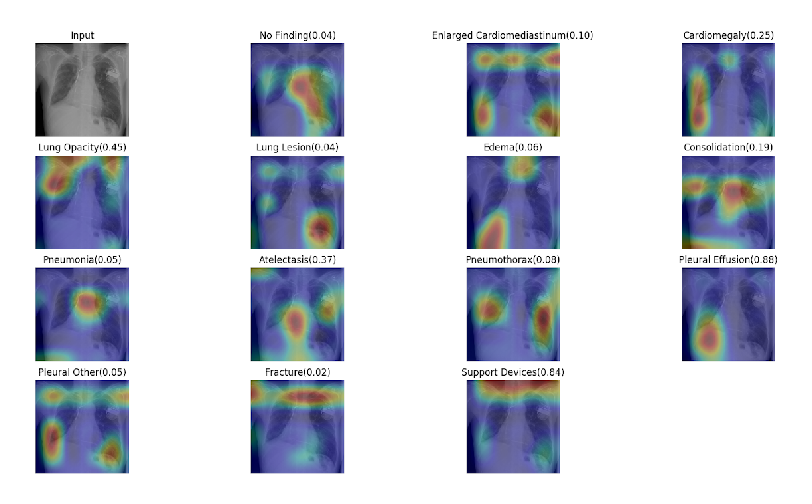

# Xception Network trained with CloGAN for unsupervised domain adaptation

The project directory consists of files, programmed in Python. The description of each file is commented in the beginning of the corresponding file. 

It s based on my thesis that is uploaded to [Academia.edu](
https://www.academia.edu/43566298/ANALYSIS_OF_DEEP_DOMAIN_SHIFT_FOR_MEDICAL_CLASSIFICATION_TASKS_ON_CHEST_X-RAY_DATASETS?source=swp_share
). The main proposals introduced here are CloGAN which 
is GAN-based multi-label domain adaptation approach and Robust Feature Mapping metrics to analyze the influence of domain adaptation approaches to the feature mapping of neural network.

##### Table of Contents  
- [Why?](#why)  
- [Testing](#testing)
- [Future improvements](#future-improvements)
- [CONTRIBUTING](#contributing)
- [LICENSE](#license)

## Why?
Supervised labeling of the training data is often scarce in a lot of task. The medical classification task is no exception. The main reason to develop this technique of unsupervised domain adaptation is to utilize the unlabelled training data to strengthen the network in classifying diseases. This also encourages the network to learn over other similar domains, e.g. X-ray images from other hospitals.

## Testing
Before testing, make sure that the weights of the Xception network is prepared. To have the pre-trained model, download https://github.com/samuelmat19/CloGAN/releases/download/pretrained-model/model.hdf5 and copy it to "resources" directory.

### Predict abnormalities/symptoms in chest X-ray image with Xception network, trained on classification loss and CloGAN

1. Make sure that Python 3 is installed in your system.
2. Open terminal or command line that has access to the Python binary and change the directory to this project.
3. Install Python virtual environment : `pip3 install --user virtualenv`, in case you do not have the virtual environment installed.
4. Create new virtual environment : `python3 -m venv CloGAN`
5. Activate the virtual environment : In Linux and macOS, run `source CloGAN/bin/activate` and in Windows, `.\CloGAN\Scripts\activate`
6. Install the required libraries in the virtual environment : `pip install -r requirements.txt`. Note that the tensorflow in the requirements.txt is CPU version.
7. Run the CloGAN_predict.py with : `python CloGAN_predict.py`

8. Input the file path of the chest X-ray image to be predicted. (There are two examples that you could use, taken from ChestXray-14: **resources/cardiomegaly.png** and **resources/effusion.png**)
9. The predictions with saliency maps will be generated.
10. Enter `exit` if you want to leave the app.

11. You can leave the virtual environment : `deactivate`

## CONTRIBUTING
To contribute to the project, these steps can be followed. Anyone that contributes will surely be recognized and mentioned here!

Contributions to the project are made using the "Fork & Pull" model. The typical steps would be:

1. create an account on [github](https://github.com)
2. fork this repository
3. make a local clone
4. make changes on the local copy
5. commit changes `git commit -m "my message"`
6. `push` to your GitHub account: `git push origin`
7. create a Pull Request (PR) from your GitHub fork
(go to your fork's webpage and click on "Pull Request."
You can then add a message to describe your proposal.)

## LICENSE
This open-source project is licensed under MIT License.
